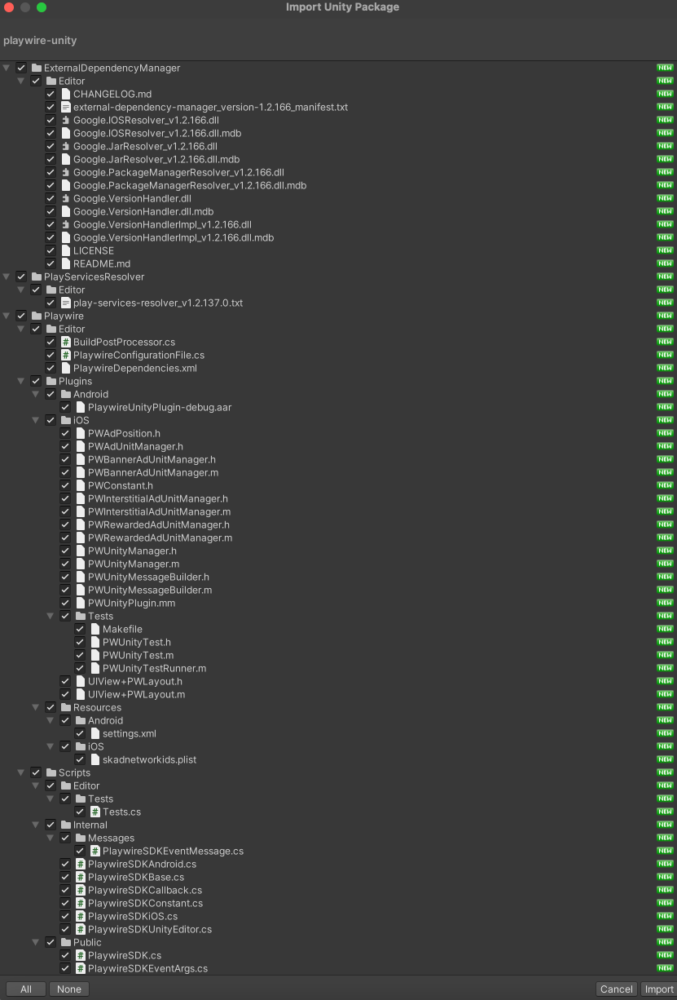
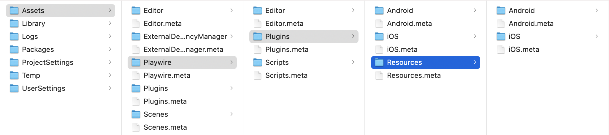
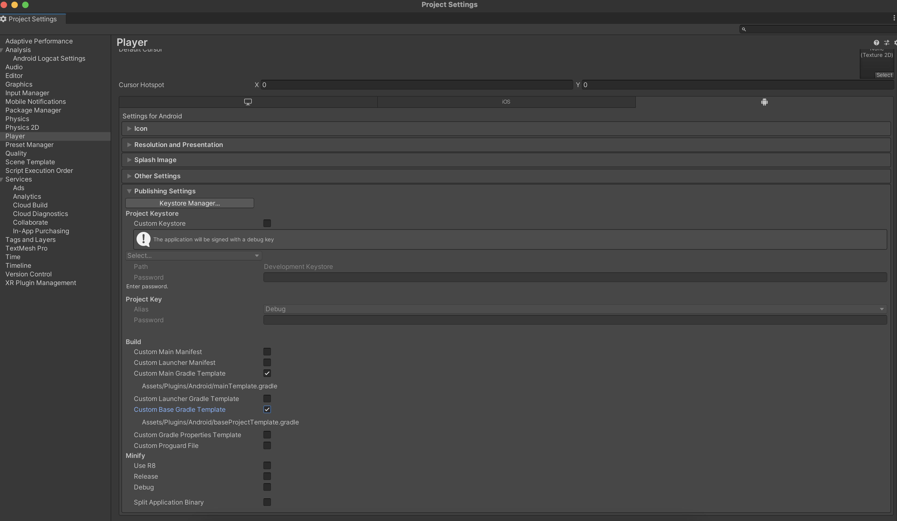
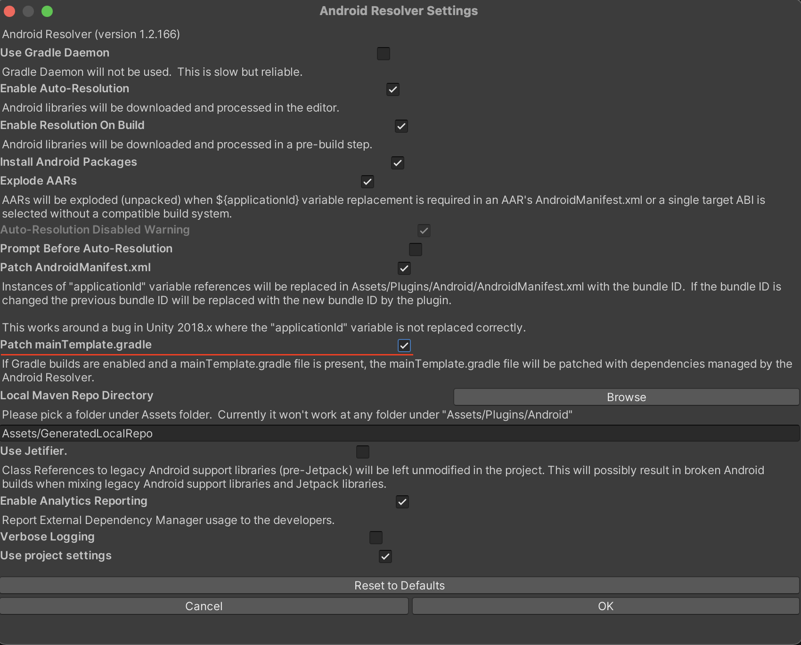

<H1 align="center">Playwire Unity SDK</H1>

<p align="center">
    <a></a>
    <a href="https://unity.com/"></a>
</p>

---

# Requirements

- Unity 2019.4.30f1+ (LTS)
- iOS 11.0+
- Android 5.0+ (API 21+)

# Installation

Follow these steps to import the `Playwire Unity SDK` to your project:

1. Download the latest `Playwire Unity SDK` package [here](https://github.com/intergi/playwire-unity-package).
2. Open the Unity Editor, go to `Assets > Import Package > Custom Package`.
3. In the Import Unity Package window, keep all the files selected, then click `Import`.


4. Once importing has been finished, the set of dependencies should be resolved. Follow the [Dependencies installation](#dependencies-installation) section to resolve all required dependencies.
5. Search for the configuration files emailed by your Playwire Account Manager. You should have files for both iOS and Android.
6. Copy and paste the file to `Assets/Playwire/Plugins/Resources/iOS` (for the iOS file) and `Assets/Playwire/Plugins/Resources/Android` (for the Android file).
7. See the [Configuration](#configuration) section for the specific steps on how to work with configuration files, especially if you use a custom configuration filename.


8. Build and run your Unity project.

# Dependencies installation

The `Playwire Unity SDK` is configured to use the [External Dependency Manager](https://github.com/googlesamples/unity-jar-resolver) (formerly Play Services Resolver/Jar Resolver). This is a complex tool for managing and automating dependencies for iOS (CocoaPods) and Android (Gradle).

See the list of options to resolve and adjust settings in `Assets > External Dependency Manager`. If it is not available for you, go to `File > Build settings > Select iOS or Android > Switch Platform`.

> **Note**: If you are integrating an updated version of the `Playwire Unity SDK` on top of existing one, you may face an issue while building iOS project's workspace. The thing is Unity fails to download newest podspecs from remote repository to your local repository (`Users/<USER_NAME>/.cocoapods/repo`) while building iOS project. Thus you need to do it by yourselves just by running command to actualize local `Playwire iOS` pods. By default pod repo's name is `intergi` and to update latest podspecs, please run the next command in Terminal.

```bash
$ pod repo update intergi
```
## iOS

The External Dependency Manager uses [CocoaPods](https://guides.cocoapods.org/using/getting-started.html#getting-started) to install the iOS dependencies.

All dependencies are resolved automatically during the build process. The build scripts run specified pod commands to install dependencies and configure an iOS project according to the settings. You can check and adjust resolver settings in `Assets > External Dependency Manager > iOS Resolver > Settings`.

> **Note**: The `Playwire Unity SDK` requires CocoaPods version >= `1.10.2` to install the iOS dependencies.
## Android

The External Dependency Manager uses [Gradle](https://docs.gradle.org/current/userguide/getting_started.html) to install the Android dependencies.

To resolve required dependencies for Android you should follow next steps:

1. As the `Playwire Unity SDK` consumes native Android SDK from the remote GitHub Packages repository, even though such SDK is accessible publicly there, GitHub still requires to do authentication, that is why the `Playwire Unity SDK` is configured to have **`keystore.properties`** that should contain credentials to access GitHub package. See official [GitHub Package's guide](https://docs.github.com/en/packages/working-with-a-github-packages-registry/working-with-the-gradle-registry) to get more details about Github authentication.

> **Note**: To learn more about `keystore.properties` usage, please visit official [Android Developer's Tutorial](https://developer.android.com/studio/publish/app-signing#secure-shared-keystore)

You have to create a `keystore.properties` file by yourself using the template below and put to `Assets/Playwire/Plugin/Resources/Android` directory.

```
maven_repo_read_url=https://maven.pkg.github.com/intergi/playwire-android-binaries
maven_repo_read_username=<GITHUB_USERNAME>
maven_repo_read_password=<GITHUB_ACCESS_TOKEN>
```

2. Go to `Edit > Project Settings > Player > Settings for Android > Publishing Settings` and check `Custom Base Gradle Template`. 



Once you check this option, you will see the path where this file is stored. You should open and modify it with next changes:

```gradle
// GENERATED BY UNITY. REMOVE THIS COMMENT TO PREVENT OVERWRITING WHEN EXPORTING AGAIN

def keystorePropertiesFile = rootProject.file("keystore.properties")
def keystoreProperties = new Properties()
keystoreProperties.load(new FileInputStream(keystorePropertiesFile))

// ...

allprojects {
    // ...
    repositories {**ARTIFACTORYREPOSITORY**
        // ...
        maven {
            name = "GitHubPackages"
            url = uri(keystoreProperties['maven_repo_read_url'])
            credentials {
                username = keystoreProperties['maven_repo_read_username']
                password = keystoreProperties['maven_repo_read_password']
            }
        }
        maven {
            url 'https://android-sdk.is.com/'
        }
        maven {
            url "https://s3.amazonaws.com/smaato-sdk-releases/"
        }
        // ...
    }
    // ...
}
```
3. Go to `Edit > Project Settings > Player > Settings for Android > Publishing Settings` and check `Custom Main Gradle Template` checkbox.
4. Go to `Assets > External Dependency Manager > Android Resolver > Settings`, and verify that `Patch mainTemplate.gradle` is enabled.


5. When done, go to `Assets > External Dependency Manager > Android Resolver`, and click `Force Resolve` to start the automatic dependency resolving.

# Usage

## Initialization

Initialize the Playwire Unity SDK in your app’s [`Start()`](https://docs.unity3d.com/ScriptReference/MonoBehaviour.Start.html) method.

```csharp
PlaywireSDK.InitializeSDK();
```

When done, you will receive the `PlaywireSDKCallback.OnSDKInitializedEvent`.

> **Note**: If you call any method without initialization, the SDK notifies you about it in the IDE logs window.

## Configuration

The `Playwire Unity SDK` retrieves configuration data from the JSON file provided by Playwire. If you do not have this file, contact your Playwire Account Manager.
By default, the `Playwire Unity SDK` looks for **`PWConfigFile.json`**.
You can also provide a custom filename and set it as the config file for the SDK.

```csharp
string configName = "CUSTOM_CONFIG_FILE_NAME";
PlaywireSDK.SetConfigName(configName);

PlaywireSDK.InitializeSDK();
```

If you use a custom filename, you have to provide some modifications for `PostBuildProcessoriOS` or `PostBuildProcessorAndroid`. There are services that simplify the `Playwire Unity SDK` integration, because it takes over iOS and Android projects adjustments, such as, setup required identifiers, settings and permissions, etc. We do not recommend modifying it unless you have to, such as in case above.
Open `Assets/Playwire/Editor/PostBuildProcessoriOS.cs` and replace `iOSConfigurationFile` value, then open `Assets/Playwire/Editor/PostBuildProcessorAndroid.cs`and replace `androidConfigurationFile` value with your custom filename. This step is mandatory to avoid runtime issues.

> **Note**: To avoid any SDK configuration issues, set the custom config filename before initialization.
## Request for ads

### Request banner ads

To display a banner ad on your app, you must first request for the ad. Provide the ad unit and where it should be positioned.

> **Note**: If your Unity project is implemented on both iOS and Android platforms, the banner is placed in the same position, but you must use different ad units for each platform. See `UNITY_IOS` and `UNITY_ANDROID` [platform #define directives](https://docs.unity3d.com/Manual/PlatformDependentCompilation.html) as a possible solution.

```csharp
string BannerAdUnitId = "Banner";
PlaywireSDK.LoadBanner(BannerAdUnitId, PlaywireSDKBase.AdPosition.BottomCenter);
```

See table with available banner positions below.

| PlaywireSDKBase.AdPosition     | Description                                                 |
| ------------------------------ | ----------------------------------------------------------- |
| TopLeft                        | The banner is placed at the top left of the screen.      |
| TopCenter                      | The banner is placed at the top center of the screen.    |
| TopRight                       | The banner is placed at the top right of the screen.     |
| CenterLeft                     | The banner is placed at the center left of the screen.   |
| Center                         | The banner is placed at the center of the screen.        |
| CenterRight                    | The banner is placed at the center right of the screen.  |
| BottomLeft                     | The banner is placed at the bottom left of the screen.   |
| BottomCenter                   | The banner is placed at the bottom center of the screen. |
| BottomRight                    | The banner is placed at the bottom right of the screen.  |

If the banner is loaded successfully, you would receive `PlaywireSDKCallback.Banner.OnLoadedEvent`. If not, you would receive `PlaywireSDKCallback.Banner.OnFailedToLoadEvent`.

In case the banner is ready to be displayed, you can show it on the screen at the position you passed during loading or hide it.

```csharp
string BannerAdUnitId = "Banner";

PlaywireSDK.ShowBanner(BannerAdUnitId);

PlaywireSDK.HideBanner(BannerAdUnitId);
```

In case the banner should be deallocated, you have to destroy it, e.g., in your app's [`OnDestroy()`](https://docs.unity3d.com/ScriptReference/MonoBehaviour.OnDestroy.html) method.

```csharp
string BannerAdUnitId = "Banner";

PlaywireSDK.DestroyBanner(BannerAdUnitId);
```

`PlaywireSDKCallback.Banner` provides the banner-related callbacks to inform you of the banner ad lifecycle. You can subscribe to be notified about events and how to handle them.

```csharp
void OnEnable () 
{
    // ...
    PlaywireSDKCallback.Banner.OnLoadedEvent += OnBannerLoadedEvent;
    PlaywireSDKCallback.Banner.OnFailedToLoadEvent += OnBannerFailedToLoadEvent;
    // ...
}

void OnBannerLoadedEvent(PlaywireSDKEventArgs args) 
{
    // ...
    PlaywireSDK.ShowBanner(args.AdUnitId);
    // ...
}

void OnBannerFailedToLoadEvent(PlaywireSDKEventArgs args) 
{
    // ...
}
```

See the list below for banner-related callbacks.

```csharp
... PlaywireSDKCallback {
    ... Banner {
        /// It is fired when the banner ad successfully loaded content.
        public static event Action<PlaywireSDKEventArgs> OnLoadedEvent

        /// It is fired when the banner ad failed to load content.
        public static event Action<PlaywireSDKEventArgs> OnFailedToLoadEvent

        /// It is fired when the banner ad presented content.
        public static event Action<PlaywireSDKEventArgs> OnOpenedEvent

        /// It is fired when the banner ad dismissed content.
        public static event Action<PlaywireSDKEventArgs> OnClosedEvent

        /// It is fired when a click has been recorded for the banner ad.
        public static event Action<PlaywireSDKEventArgs> OnClickedEvent

        /// It is fired when an impression has been recorded for the banner ad.
        public static event Action<PlaywireSDKEventArgs> OnRecordedImpressionEvent
    }
}
```

### Request for interstitial ads

To display an interstitial ad on your app, you must first request it and provide the ad unit.

When requesting  an interstitial ad, we recommend that you do so in advance before planning to present it to your user as the loading process may take time.

```csharp
string InterstitialAdUnitId = "Interstitial";
PlaywireSDK.LoadInterstitial(InterstitialAdUnitId);
```

> **Note**: An interstitial ad is a one-time-use object, which means it must be loaded again after its shown. Use the `PlaywireSDK.IsInterstitialReady(string adUnitId)` method to check if the ad is ready to be presented.

If the interstitial is loaded successfully, you would receive `PlaywireSDKCallback.Interstitial.OnLoadedEvent`. If not, you would receive `PlaywireSDKCallback.Interstitial.OnFailedToLoadEvent`.
In case the interstitial is ready to be displayed, you can present full screen content.

```csharp
string InterstitialAdUnitId = "Interstitial";
PlaywireSDK.ShowInterstitial(InterstitialAdUnitId);
```

> **Note**: The interstitial ad is presented only if it is loaded and not shown previously. Otherwise, `PlaywireSDKCallback.Interstitial.OnFailedToOpenEvent` is invoked.

`PlaywireSDKCallback.Interstitial` provides interstitial-related callbacks to inform you about an interstitial ad lifecycle. You can subscribe to be notified about events and how to handle them.

```csharp
void OnEnable () 
{
    // ...
    PlaywireSDKCallback.Interstitial.OnLoadedEvent += OnInterstitialLoadedEvent;
    PlaywireSDKCallback.Interstitial.OnFailedToLoadEvent += OnInterstitialFailedToLoadEvent;
    // ...
}

void OnInterstitialLoadedEvent(PlaywireSDKEventArgs args) 
{
    // ...
    bool isInterstitialReady = PlaywireSDK.IsInterstitialReady(args.AdUnitId);

    if (!isInterstitialReady) {
        // Load interstitial again or show error.
        return;
    }
    PlaywireSDK.ShowInterstitial(args.AdUnitId);
    // ...
}

void OnInterstitialFailedToLoadEvent(PlaywireSDKEventArgs args) 
{
    // ...
}
```

See the list below for interstitial-related callbacks.

```csharp
... PlaywireSDKCallback {
    ... Interstitial {
        /// It is fired when the interstitial ad successfully loaded full screen content and ready to be presented.
        public static event Action<PlaywireSDKEventArgs> OnLoadedEvent

        /// It is fired when the interstitial ad failed to load full screen content.
        public static event Action<PlaywireSDKEventArgs> OnFailedToLoadEvent

        /// It is fired when the interstitial ad presented full screen content.
        public static event Action<PlaywireSDKEventArgs> OnOpenedEvent

        /// It is fired when the interstitial ad failed to present full screen content.
        public static event Action<PlaywireSDKEventArgs> OnFailedToOpenEvent

        /// It is fired when an interstitial ad dismissed full screen content and the user goes back to the application screen.
        public static event Action<PlaywireSDKEventArgs> OnClosedEvent

        /// It is fired when an impression has been recorded for the interstitial ad.
        public static event Action<PlaywireSDKEventArgs> OnRecordedImpressionEvent

        /// It is fired when a click has been recorded for the interstitial ad.
        public static event Action<PlaywireSDKEventArgs> OnClickedEvent
    }
}
```

### Request for rewarded ads

To display a rewarded ad on your app, you must first request it and provide the ad unit.

When requesting a rewarded ad, we recommend that you do so in advance before planning to present it to your user as the loading process may take time.

```csharp
string RewardedAdUnitId = "Rewarded";
PlaywireSDK.LoadRewarded(RewardedAdUnitId);
```

> **Note**: A rewarded ad is a one-time-use object, which means it must be loaded again after its shown. Use the `PlaywireSDK.IsRewardedReady(string adUnitId)` method to check if the ad is ready to be presented.

If the rewarded ad is loaded successfully, you would receive `PlaywireSDKCallback.Rewarded.OnLoadedEvent`. If not, you would receive `PlaywireSDKCallback.Rewarded.OnFailedToLoadEvent`.
In case the rewarded is ready to be displayed, you can present full screen content.

```csharp
string RewardedAdUnitId = "Rewarded";
PlaywireSDK.ShowRewarded(RewardedAdUnitId);
```

> **Note**: The rewarded ad is presented only if it is loaded and not shown previously. Otherwise `PlaywireSDKCallback.Rewarded.OnFailedToOpenEvent` is invoked.

`PlaywireSDKCallback.Rewarded` provides rewarded-related callbacks to inform you about a rewarded ad lifecycle. You can subscribe to be notified about the events and how to handle them.

```csharp
void OnEnable () 
{
    // ...
    PlaywireSDKCallback.Rewarded.OnLoadedEvent += OnRewardedLoadedEvent;
    PlaywireSDKCallback.Rewarded.OnFailedToLoadEvent += OnRewardedFailedToLoadEvent;
    // ...
}

void OnRewardedLoadedEvent(PlaywireSDKEventArgs args) 
{
    // ...
    bool isRewardedReady = PlaywireSDK.IsRewardedReady(args.AdUnitId);

    if (!isRewardedReady) {
        // Load the rewarded again or show error.
        return;
    }
    PlaywireSDK.ShowRewarded(args.AdUnitId);
}

void OnRewardedFailedToLoadEvent(PlaywireSDKEventArgs args) 
{
    // ...
}
```

See the list below for rewarded-related callbacks.

```csharp
... PlaywireSDKCallback {
    ... Rewarded {
        /// It is fired when the rewarded ad successfully loaded full screen content and ready to be presented.
        public static event Action<PlaywireSDKEventArgs> OnLoadedEvent

        /// It is fired when the rewarded ad failed to load full screen content.
        public static event Action<PlaywireSDKEventArgs> OnFailedToLoadEvent

        /// It is fired when the rewarded ad presented full screen content.
        public static event Action<PlaywireSDKEventArgs> OnOpenedEvent

        /// It is fired when the rewarded ad failed to present full screen content.
        public static event Action<PlaywireSDKEventArgs> OnFailedToOpenEvent

        /// It is fired when an rewarded ad dismissed full screen content and the user goes back to the application screen.
        public static event Action<PlaywireSDKEventArgs> OnClosedEvent

        /// It is fired when an impression has been recorded for the rewarded ad.
        public static event Action<PlaywireSDKEventArgs> OnRecordedImpressionEvent

        /// It is fired when a reward has been earned.
        public static event Action<PlaywireSDKAdRewardEventArgs> OnEarnedEvent

        /// It is fired when a click has been recorded for the rewarded ad.
        public static event Action<PlaywireSDKEventArgs> OnClickedEvent
    }
}
```

### Logger

To start monitoring events inside the `Playwire Unity SDK` use logger to log events to the IDE console. The logs can contain information about event's name, ad unit parameters, ad server response, etc.

```csharp
PlaywireSDK.StartConsoleLogger();
```