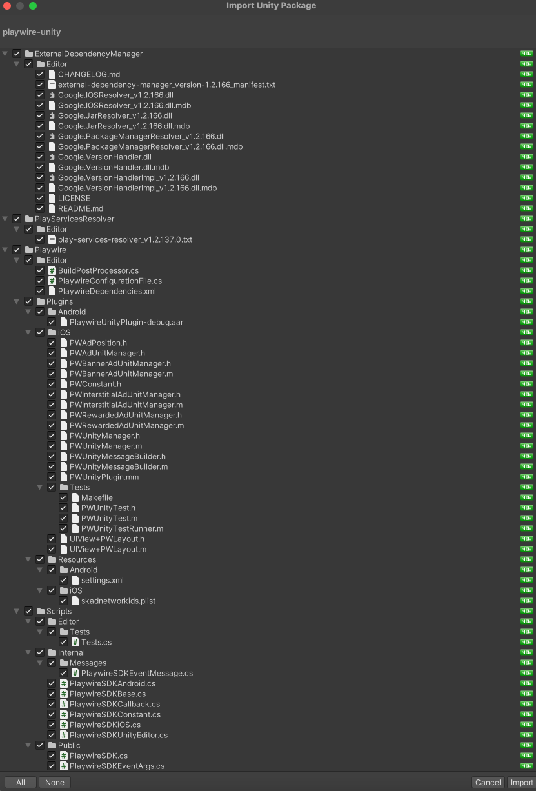
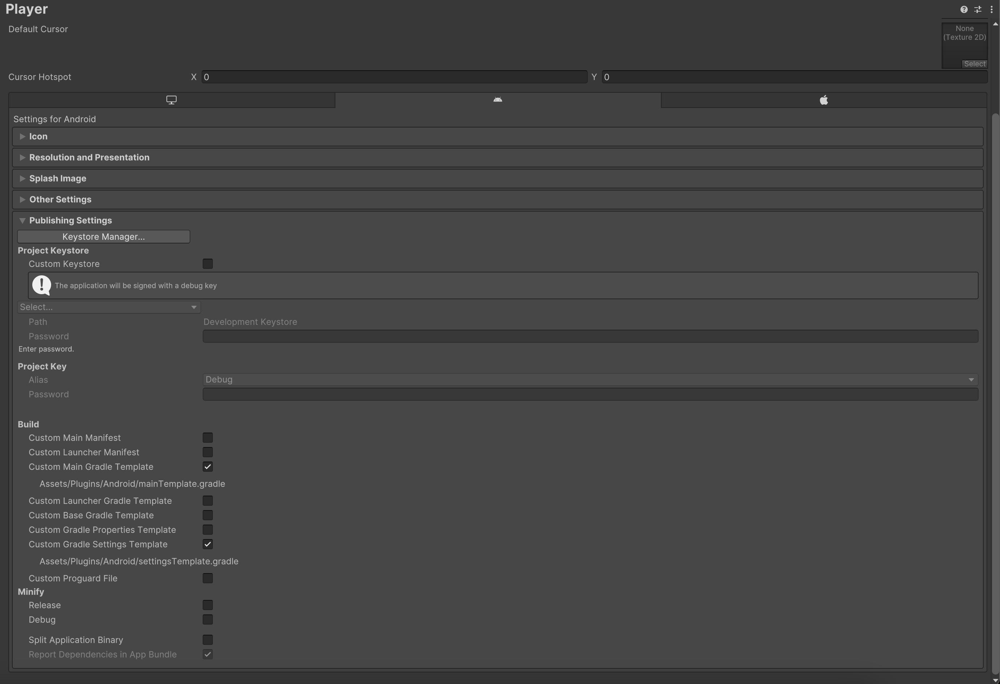

<H1 align="center">Playwire Unity SDK</H1>

<p align="center">
    <a></a>
    <a href="https://unity.com/"></a>
</p>

---

# Requirements

- Unity 2019.4.30f1+ (LTS)
- iOS 12.0+
- Android 5.0+ (API 21+)

# Installation

Follow these steps to import the `Playwire Unity SDK` to your project:

1. Download the latest `Playwire Unity SDK` package [here](https://github.com/intergi/playwire-unity-package).
2. Open the Unity Editor, go to `Assets > Import Package > Custom Package`.
3. In the Import Unity Package window, keep all the files selected, then click `Import`.

4. Once importing has been finished, the set of dependencies should be resolved. Follow the [Dependencies installation](#dependencies-installation) section to resolve all required dependencies.
5. Search for the initialization metadata (`publisherId` and `appId`) emailed by your Playwire Account Manager.
6. See the [Configuration](#configuration) section to adjust the project's configuration.
7. Build and run your Unity project.

# Dependencies installation

The `Playwire Unity SDK` is configured to use the [External Dependency Manager](https://github.com/googlesamples/unity-jar-resolver) (formerly Play Services Resolver/Jar Resolver). This is a complex tool for managing and automating dependencies for iOS (CocoaPods) and Android (Gradle).

See the list of options to resolve and adjust settings in `Assets > External Dependency Manager`. If it is not available for you, go to `File > Build settings > Select iOS or Android > Switch Platform`.

> **Note**: If you are integrating an updated version of the `Playwire Unity SDK` on top of existing one, you may face an issue while building iOS project's workspace. The thing is Unity fails to download newest podspecs from remote repository to your local repository (`Users/<USER_NAME>/.cocoapods/repo`) while building iOS project. Thus you need to do it by yourselves just by running command to actualize local `Playwire iOS` pods. By default pod repo's name is `intergi` and to update latest podspecs, please run the next command in Terminal.

```bash
$ pod repo update intergi
```
## iOS

The External Dependency Manager uses [CocoaPods](https://guides.cocoapods.org/using/getting-started.html#getting-started) to install the iOS dependencies.

All dependencies are resolved automatically during the build process. The build scripts run specified pod commands to install dependencies and configure an iOS project according to the settings. You can check and adjust resolver settings in `Assets > External Dependency Manager > iOS Resolver > Settings`.

> **Note**: The `Playwire Unity SDK` requires CocoaPods version >= `1.10.2` to install the iOS dependencies.
## Android

The External Dependency Manager uses [Gradle](https://docs.gradle.org/current/userguide/getting_started.html) to install the Android dependencies.

To resolve required dependencies for Android you should follow next steps:

1. As the `Playwire Unity SDK` consumes native Android SDK from the remote GitHub Packages repository, even though such SDK is accessible publicly there, GitHub still requires to do authentication, that is why the `Playwire Unity SDK` is configured to have **`keystore.properties`** that should contain credentials to access GitHub package. See official [GitHub Package's guide](https://docs.github.com/en/packages/working-with-a-github-packages-registry/working-with-the-gradle-registry) to get more details about Github authentication.

> **Note**: To learn more about `keystore.properties` usage, please visit official [Android Developer's Tutorial](https://developer.android.com/studio/publish/app-signing#secure-shared-keystore)

You have to create a `keystore.properties` file by yourself using the template below and put to `Assets/Playwire/Plugin/Resources/Android` directory.

```
maven_repo_read_url=https://maven.pkg.github.com/intergi/playwire-android-binaries
maven_repo_read_username=<GITHUB_USERNAME>
maven_repo_read_password=<GITHUB_ACCESS_TOKEN>
```

2. Go to `Edit > Project Settings > Player > Settings for Android > Publishing Settings` and check `Custom Base Gradle Template`. 



Once you check this option, you will see the path where this file is stored. You should open and modify it with next changes:

```gradle
// GENERATED BY UNITY. REMOVE THIS COMMENT TO PREVENT OVERWRITING WHEN EXPORTING AGAIN

def keystorePropertiesFile = rootProject.file("keystore.properties")
def keystoreProperties = new Properties()
keystoreProperties.load(new FileInputStream(keystorePropertiesFile))

// ...

allprojects {
    // ...
    buildscript {
        // ...
        dependencies {
            // ...
            classpath 'com.google.gms:google-services:4.3.13'
            **BUILD_SCRIPT_DEPS**
        }
    }

    repositories {**ARTIFACTORYREPOSITORY**
        // ...
        maven {
            name = "GitHubPackages"
            url = uri(keystoreProperties['maven_repo_read_url'])
            credentials {
                username = keystoreProperties['maven_repo_read_username']
                password = keystoreProperties['maven_repo_read_password']
            }
        }
        maven {
            url 'https://android-sdk.is.com/'
        }
        maven {
            url 'https://artifact.bytedance.com/repository/pangle/'
        }
        // ...
    }
    // ...
}
```
3. Go to `Edit > Project Settings > Player > Settings for Android > Publishing Settings` and check `Custom Main Gradle Template` checkbox.
4. Go to `Assets > External Dependency Manager > Android Resolver > Settings`, and verify that `Patch mainTemplate.gradle` is enabled.


5. When done, go to `Assets > External Dependency Manager > Android Resolver`, and click `Force Resolve` to start the automatic dependency resolving.

# Configuration

You must provide some modifications for `PostBuildProcessor`. There is a service that simplifies the `Playwire Unity SDK` integration, because it takes over iOS and Android projects adjustments, such as, setup required identifiers, settings and permissions, etc.
Open `Assets/Playwire/Editor/PostBuildProcessorAndroid.cs` and `Assets/Playwire/Editor/PostBuildProcessoriOS.cs` replace `gamAppId` values with your personal identifiers. These identifiers have to be emailed by your Playwire Account Manager.

This step is mandatory to avoid runtime issues.
# Migrating from the Total Playwire Unity SDK to the COPPA Playwire Unity SDK and vice versa

1. If you haven't made it yet, replace your `Playwire Unity SDK` package with another version package. See the [Installation](#installation) section to import a new package.
2. See the [Configuration](#configuration) section to adjust project's configuration.

# Usage

## Initialization

Initialize the Playwire Unity SDK in your app’s [`Start()`](https://docs.unity3d.com/ScriptReference/MonoBehaviour.Start.html) method.

```csharp
string publisherId = "YOUR_PUBLISHER_ID";
string appId;

#if UNITY_ANDROID
    appId = "YOUR_ANDROID_APP_ID"
#elif UNITY_IOS
    appId = "YOUR_IOS_APP_ID"
#else
    Debug.LogWarning("Unsupported platform.");
    return;
#endif

PlaywireSDK.InitializeSDK(publisherId, appId);
```

> **Note**: A configuration file metadata such as `YOUR_PUBLISHER_ID` and `YOUR_APP_ID` must be provided by your Playwire Account Manager.

When done, you will receive the `PlaywireSDKCallback.OnSDKInitializedEvent`.

> **Note**: If you call any method without initialization, the SDK notifies you about it in the IDE logs window.

### Firebase Initialization

If Firebase is integrated to the project, you must initialize the Playwire Unity SDK once you resolve all Firebase dependencies. See the [Firebase guide](https://firebase.google.com/docs/unity/setup) to complete the integration properly.

```csharp
using Firebase;

Firebase.FirebaseApp.CheckAndFixDependenciesAsync().ContinueWith(task => {
    var dependencyStatus = task.Result;
    if (dependencyStatus == Firebase.DependencyStatus.Available) {
        string publisherId = "YOUR_PUBLISHER_ID";
        string appId;

        #if UNITY_ANDROID
            appId = "YOUR_ANDROID_APP_ID"
        #elif UNITY_IOS
            appId = "YOUR_IOS_APP_ID"
        #else
            Debug.LogWarning("Unsupported platform.");
            return;
        #endif

        PlaywireSDK.InitializeSDK(publisherId, appId);
    }
});
```

## Request for ads

## Test ads

To avoid ad filling issues during development, you may enable the 'test mode' to receive test ad creatives. It should be enabled before any ads requests, e.g. before SDK initialization. For banners, interstitials and app open ads, test mode will show a blue ad. For video ads, i.e - rewarded and rewarded interstitials, test mode will show an actual video instead of a blue ad.

```csharp
PlaywireSDK.Test = true;
```

> **Note**: The test mode must be enabled only for development builds. Make sure you disabled it for production builds, otherwise it may impact on revenue.

### Request banner ads

To display a banner ad on your app, you must first request for the ad. Provide the ad unit and where it should be positioned.

> **Note**: If your Unity project is implemented on both iOS and Android platforms, the banner is placed in the same position, but you must use different ad units for each platform. See `UNITY_IOS` and `UNITY_ANDROID` [platform #define directives](https://docs.unity3d.com/Manual/PlatformDependentCompilation.html) as a possible solution.

```csharp
string BannerAdUnitId = "Banner";
PlaywireSDK.LoadBanner(BannerAdUnitId, PlaywireSDKBase.AdPosition.BottomCenter);
```

If you need to provide custom targets which will be included in an ad request, pass `customTargets` argument to the load method.

```csharp
string BannerAdUnitId = "Banner";
Dictionary<string, string> customTargets = new Dictionary<string, string>();
customTargets.Add("segment", "sport");
customTargets.Add("location", "nearby");
PlaywireSDK.LoadBanner(BannerAdUnitId, PlaywireSDKBase.AdPosition.BottomCenter, customTargets);
```

See table with available banner positions below.

| PlaywireSDKBase.AdPosition     | Description                                                 |
| ------------------------------ | ----------------------------------------------------------- |
| TopLeft                        | The banner is placed at the top left of the screen.      |
| TopCenter                      | The banner is placed at the top center of the screen.    |
| TopRight                       | The banner is placed at the top right of the screen.     |
| CenterLeft                     | The banner is placed at the center left of the screen.   |
| Center                         | The banner is placed at the center of the screen.        |
| CenterRight                    | The banner is placed at the center right of the screen.  |
| BottomLeft                     | The banner is placed at the bottom left of the screen.   |
| BottomCenter                   | The banner is placed at the bottom center of the screen. |
| BottomRight                    | The banner is placed at the bottom right of the screen.  |

If the banner is loaded successfully, you would receive `PlaywireSDKCallback.Banner.OnLoadedEvent`. If not, you would receive `PlaywireSDKCallback.Banner.OnFailedToLoadEvent`.

In case the banner is ready to be displayed, you can show it on the screen at the position you passed during loading or hide it.

```csharp
string BannerAdUnitId = "Banner";

PlaywireSDK.ShowBanner(BannerAdUnitId);

PlaywireSDK.HideBanner(BannerAdUnitId);
```

In case the banner should be deallocated, you have to destroy it, e.g., in your app's [`OnDestroy()`](https://docs.unity3d.com/ScriptReference/MonoBehaviour.OnDestroy.html) method.

```csharp
string BannerAdUnitId = "Banner";

PlaywireSDK.DestroyBanner(BannerAdUnitId);
```

In case the banner should be refreshed and the refresh data is available in the config file for this banner, you are able to refresh an ad content.

```csharp
string BannerAdUnitId = "Banner";

PlaywireSDK.RefreshBanner(BannerAdUnitId);
```

`PlaywireSDKCallback.Banner` provides the banner-related callbacks to inform you of the banner ad lifecycle. You can subscribe to be notified about events and how to handle them.

```csharp
void OnEnable () 
{
    // ...
    PlaywireSDKCallback.Banner.OnLoadedEvent += OnBannerLoadedEvent;
    PlaywireSDKCallback.Banner.OnFailedToLoadEvent += OnBannerFailedToLoadEvent;
    // ...
}

void OnBannerLoadedEvent(PlaywireSDKEventArgs args) 
{
    // ...
    PlaywireSDK.ShowBanner(args.AdUnitId);
    // ...
}

void OnBannerFailedToLoadEvent(PlaywireSDKEventArgs args) 
{
    // ...
}
```

See the list below for banner-related callbacks.

```csharp
... PlaywireSDKCallback {
    ... Banner {
        /// It is fired when the banner ad successfully loaded content.
        public static event Action<PlaywireSDKEventArgs> OnLoadedEvent

        /// It is fired when the banner ad failed to load content.
        public static event Action<PlaywireSDKEventArgs> OnFailedToLoadEvent

        /// It is fired when the banner ad presented content.
        public static event Action<PlaywireSDKEventArgs> OnOpenedEvent

        /// It is fired when the banner ad dismissed content.
        public static event Action<PlaywireSDKEventArgs> OnClosedEvent

        /// It is fired when a click has been recorded for the banner ad.
        public static event Action<PlaywireSDKEventArgs> OnClickedEvent

        /// It is fired when an impression has been recorded for the banner ad.
        public static event Action<PlaywireSDKEventArgs> OnRecordedImpressionEvent
    }
}
```

### Request for interstitial ads

To display an interstitial ad on your app, you must first request it and provide the ad unit.

When requesting  an interstitial ad, we recommend that you do so in advance before planning to present it to your user as the loading process may take time.

```csharp
string InterstitialAdUnitId = "Interstitial";
PlaywireSDK.LoadInterstitial(InterstitialAdUnitId);
```

If you need to provide custom targets which will be included in an ad request, pass `customTargets` argument to the load method.

```csharp
string InterstitialAdUnitId = "Interstitial";
Dictionary<string, string> customTargets = new Dictionary<string, string>();
customTargets.Add("segment", "sport");
customTargets.Add("location", "nearby");
PlaywireSDK.LoadInterstitial(InterstitialAdUnitId, customTargets);
```

> **Note**: An interstitial ad is a one-time-use object, which means it must be loaded again after its shown. Use the `PlaywireSDK.IsInterstitialReady(string adUnitId)` method to check if the ad is ready to be presented.

If the interstitial is loaded successfully, you would receive `PlaywireSDKCallback.Interstitial.OnLoadedEvent`. If not, you would receive `PlaywireSDKCallback.Interstitial.OnFailedToLoadEvent`.
In case the interstitial is ready to be displayed, you can present full screen content.

```csharp
string InterstitialAdUnitId = "Interstitial";
PlaywireSDK.ShowInterstitial(InterstitialAdUnitId);
```

> **Note**: The interstitial ad is presented only if it is loaded and not shown previously. Otherwise, `PlaywireSDKCallback.Interstitial.OnFailedToOpenEvent` is invoked.

`PlaywireSDKCallback.Interstitial` provides interstitial-related callbacks to inform you about an interstitial ad lifecycle. You can subscribe to be notified about events and how to handle them.

```csharp
void OnEnable () 
{
    // ...
    PlaywireSDKCallback.Interstitial.OnLoadedEvent += OnInterstitialLoadedEvent;
    PlaywireSDKCallback.Interstitial.OnFailedToLoadEvent += OnInterstitialFailedToLoadEvent;
    // ...
}

void OnInterstitialLoadedEvent(PlaywireSDKEventArgs args) 
{
    // ...
    bool isInterstitialReady = PlaywireSDK.IsInterstitialReady(args.AdUnitId);

    if (!isInterstitialReady) {
        // Load interstitial again or show error.
        return;
    }
    PlaywireSDK.ShowInterstitial(args.AdUnitId);
    // ...
}

void OnInterstitialFailedToLoadEvent(PlaywireSDKEventArgs args) 
{
    // ...
}
```

See the list below for interstitial-related callbacks.

```csharp
... PlaywireSDKCallback {
    ... Interstitial {
        /// It is fired when the interstitial ad successfully loaded full screen content and ready to be presented.
        public static event Action<PlaywireSDKEventArgs> OnLoadedEvent

        /// It is fired when the interstitial ad failed to load full screen content.
        public static event Action<PlaywireSDKEventArgs> OnFailedToLoadEvent

        /// It is fired when the interstitial ad presented full screen content.
        public static event Action<PlaywireSDKEventArgs> OnOpenedEvent

        /// It is fired when the interstitial ad failed to present full screen content.
        public static event Action<PlaywireSDKEventArgs> OnFailedToOpenEvent

        /// It is fired when an interstitial ad dismissed full screen content and the user goes back to the application screen.
        public static event Action<PlaywireSDKEventArgs> OnClosedEvent

        /// It is fired when an impression has been recorded for the interstitial ad.
        public static event Action<PlaywireSDKEventArgs> OnRecordedImpressionEvent

        /// It is fired when a click has been recorded for the interstitial ad.
        public static event Action<PlaywireSDKEventArgs> OnClickedEvent
    }
}
```

### Request for rewarded ads

To display a rewarded ad on your app, you must first request it and provide the ad unit.

When requesting a rewarded ad, we recommend that you do so in advance before planning to present it to your user as the loading process may take time.

```csharp
string RewardedAdUnitId = "Rewarded";
PlaywireSDK.LoadRewarded(RewardedAdUnitId);
```

If you need to provide custom targets which will be included in an ad request, pass `customTargets` argument to the load method.

```csharp
string RewardedAdUnitId = "Rewarded";
Dictionary<string, string> customTargets = new Dictionary<string, string>();
customTargets.Add("segment", "sport");
customTargets.Add("location", "nearby");
PlaywireSDK.LoadRewarded(RewardedAdUnitId, customTargets);
```

> **Note**: A rewarded ad is a one-time-use object, which means it must be loaded again after its shown. Use the `PlaywireSDK.IsRewardedReady(string adUnitId)` method to check if the ad is ready to be presented.

If the rewarded ad is loaded successfully, you would receive `PlaywireSDKCallback.Rewarded.OnLoadedEvent`. If not, you would receive `PlaywireSDKCallback.Rewarded.OnFailedToLoadEvent`.
In case the rewarded is ready to be displayed, you can present full screen content.

```csharp
string RewardedAdUnitId = "Rewarded";
PlaywireSDK.ShowRewarded(RewardedAdUnitId);
```

> **Note**: The rewarded ad is presented only if it is loaded and not shown previously. Otherwise `PlaywireSDKCallback.Rewarded.OnFailedToOpenEvent` is invoked.

`PlaywireSDKCallback.Rewarded` provides rewarded-related callbacks to inform you about a rewarded ad lifecycle. You can subscribe to be notified about the events and how to handle them.

```csharp
void OnEnable () 
{
    // ...
    PlaywireSDKCallback.Rewarded.OnLoadedEvent += OnRewardedLoadedEvent;
    PlaywireSDKCallback.Rewarded.OnFailedToLoadEvent += OnRewardedFailedToLoadEvent;
    PlaywireSDKCallback.Rewarded.OnEarnedEvent += OnRewardEarnedEvent;
    // ...
}

void OnRewardedLoadedEvent(PlaywireSDKEventArgs args) 
{
    // ...
    bool isRewardedReady = PlaywireSDK.IsRewardedReady(args.AdUnitId);

    if (!isRewardedReady) {
        // Load the rewarded again or show error.
        return;
    }
    PlaywireSDK.ShowRewarded(args.AdUnitId);
}

void OnRewardedFailedToLoadEvent(PlaywireSDKEventArgs args) 
{
    // ...
}

void OnRewardEarnedEvent(PlaywireSDKAdRewardEventArgs args) 
{
    Debug.Log("Ad reward earned type: " + args.Type + " amount: " + args.Amount.ToString());
}

```

See the list below for rewarded-related callbacks.

```csharp
... PlaywireSDKCallback {
    ... Rewarded {
        /// It is fired when the rewarded ad successfully loaded full screen content and ready to be presented.
        public static event Action<PlaywireSDKEventArgs> OnLoadedEvent

        /// It is fired when the rewarded ad failed to load full screen content.
        public static event Action<PlaywireSDKEventArgs> OnFailedToLoadEvent

        /// It is fired when the rewarded ad presented full screen content.
        public static event Action<PlaywireSDKEventArgs> OnOpenedEvent

        /// It is fired when the rewarded ad failed to present full screen content.
        public static event Action<PlaywireSDKEventArgs> OnFailedToOpenEvent

        /// It is fired when an rewarded ad dismissed full screen content and the user goes back to the application screen.
        public static event Action<PlaywireSDKEventArgs> OnClosedEvent

        /// It is fired when an impression has been recorded for the rewarded ad.
        public static event Action<PlaywireSDKEventArgs> OnRecordedImpressionEvent

        /// It is fired when a reward has been earned.
        public static event Action<PlaywireSDKAdRewardEventArgs> OnEarnedEvent

        /// It is fired when a click has been recorded for the rewarded ad.
        public static event Action<PlaywireSDKEventArgs> OnClickedEvent
    }
}
```

### Request for app open ads

To display an app open ad on your app, you must first request it and provide the ad unit.

When requesting an app open ad, we recommend that you do so in advance before planning to present it to your user as the loading process may take time.

```csharp
string AppOpenAdUnitId = "AppOpenAd";
PlaywireSDK.LoadAppOpenAd(AppOpenAdUnitId);
```

If you need to provide custom targets which will be included in an ad request, pass `customTargets` argument to the load method.

```csharp
string AppOpenAdUnitId = "AppOpenAd";
Dictionary<string, string> customTargets = new Dictionary<string, string>();
customTargets.Add("segment", "sport");
customTargets.Add("location", "nearby");
PlaywireSDK.LoadAppOpenAd(AppOpenAdUnitId, customTargets);
```

> **Note**: An app open ad is a one-time-use object, which means it must be loaded again after its shown. Use the `PlaywireSDK.IsAppOpenAdReady(string adUnitId)` method to check if the ad is ready to be presented.

An app open ad will time out after four hours. If you present an ad content that was requested more than four hours, it will no longer be valid and may not earn revenue.
To ensure you do not show an expired ad, you can check how long it has been since your ad loaded and reload it manually, or you may enable `AppOpenAdReloadOnExpiration` to let the `PlaywireSDK` monitors the ad expiration and take care about reloading the expired ad.

```csharp

string AppOpenAdUnitId = "AppOpenAd";

bool isEnabled = PlaywireSDK.GetAppOpenAdReloadOnExpiration(AppOpenAdUnitId);

if(!isEnabled) {
    PlaywireSDK.SetAppOpenAdReloadOnExpiration(AppOpenAdUnitId, true);
}
```

If the app open ad is loaded successfully, you would receive `PlaywireSDKCallback.AppOpenAd.OnLoadedEvent`. If not, you would receive `PlaywireSDKCallback.AppOpenAd.OnFailedToLoadEvent`.
In case the app open ad is ready to be displayed, you can present full screen content.

```csharp
string AppOpenAdUnitId = "AppOpenAd";
PlaywireSDK.ShowAppOpenAd(AppOpenAdUnitId);
```

> **Note**: The app open ad is presented only if it is loaded and not shown previously. Otherwise, `PlaywireSDKCallback.AppOpenAd.OnFailedToOpenEvent` is invoked.

As app open ads are designed to be shown when a user brings your app to the foreground, you need to listen to the application pause message. You can do it by implementing the [`OnApplicationPause(bool)`](https://docs.unity3d.com/ScriptReference/MonoBehaviour.OnApplicationPause.html) method, your app will be alerted to app launch and foregrounding events and be able to show the ad.

```csharp
public void OnApplicationPause(bool paused)
{
    string AppOpenAdUnitId = "AppOpenAd";
    
    // Display the app open ad when the app enters foreground
    if (!paused)
    {
        PlaywireSDK.ShowAppOpenAd(AppOpenAdUnitId);
    }
}
```

`PlaywireSDKCallback.AppOpenAd` provides 'app open ad'-related callbacks to inform you about an app open ad lifecycle. You can subscribe to be notified about events and how to handle them.

```csharp
void OnEnable () 
{
    // ...
    PlaywireSDKCallback.AppOpenAd.OnLoadedEvent += OnAppOpenAdLoadedEvent;
    PlaywireSDKCallback.AppOpenAd.OnFailedToLoadEvent += OnAppOpenAdFailedToLoadEvent;
    // ...
}

void OnAppOpenAdLoadedEvent(PlaywireSDKEventArgs args) 
{
    // ...
    bool isAppOpenAdReady = PlaywireSDK.IsAppOpenAdReady(args.AdUnitId);

    if (!isAppOpenAdReady) {
        // Load app open ad again or show error.
        return;
    }
    PlaywireSDK.ShowAppOpenAd(args.AdUnitId);
    // ...
}

void OnAppOpenAdFailedToLoadEvent(PlaywireSDKEventArgs args) 
{
    // ...
}
```

See the list below for 'app open ad'-related callbacks.

```csharp
... PlaywireSDKCallback {
    ... AppOpenAd {
        /// It is fired when the app open ad successfully loaded full screen content and ready to be presented.
        public static event Action<PlaywireSDKEventArgs> OnLoadedEvent

        /// It is fired when the app open ad failed to load full screen content.
        public static event Action<PlaywireSDKEventArgs> OnFailedToLoadEvent

        /// It is fired when the app open ad presented full screen content.
        public static event Action<PlaywireSDKEventArgs> OnOpenedEvent

        /// It is fired when the app open ad failed to present full screen content.
        public static event Action<PlaywireSDKEventArgs> OnFailedToOpenEvent

        /// It is fired when an app open ad dismissed full screen content and the user goes to the application.
        public static event Action<PlaywireSDKEventArgs> OnClosedEvent

        /// It is fired when an impression has been recorded for the app open ad.
        public static event Action<PlaywireSDKEventArgs> OnRecordedImpressionEvent

        /// It is fired when a click has been recorded for the app open ad.
        public static event Action<PlaywireSDKEventArgs> OnClickedEvent
    }
}
```

### Request for rewarded interstitial ads

To display a rewarded interstitial ad on your app, you must first request it and provide the ad unit.

When requesting a rewarded interstitial ad, we recommend that you do so in advance before planning to present it to your user as the loading process may take time.

```csharp
string RewardedIntestitialAdUnitId = "RewardedInterstitial";
PlaywireSDK.LoadRewardedInterstitial(RewardedIntestitialAdUnitId);
```

If you need to provide custom targets which will be included in an ad request, pass `customTargets` argument to the load method.

```csharp
string RewardedIntestitialAdUnitId = "RewardedInterstitial";
Dictionary<string, string> customTargets = new Dictionary<string, string>();
customTargets.Add("segment", "sport");
customTargets.Add("location", "nearby");
PlaywireSDK.LoadRewardedInterstitial(RewardedIntestitialAdUnitId, customTargets);
```

> **Note**: A rewarded interstitial ad is a one-time-use object, which means it must be loaded again after its shown. Use the `PlaywireSDK.IsRewardedInterstitialReady(string adUnitId)` method to check if the ad is ready to be presented.

If the rewarded interstitial ad is loaded successfully, you would receive `PlaywireSDKCallback.RewardedInterstitial.OnLoadedEvent`. If not, you would receive `PlaywireSDKCallback.RewardedInterstitial.OnFailedToLoadEvent`.

In case the rewarded interstitial is ready to be displayed, you can present full screen content.

```csharp
string RewardedInterstitialAdUnitId = "RewardedInterstitial";
PlaywireSDK.ShowRewardedInterstitial(RewardedInterstitialAdUnitId);
```

> **Note**: The rewarded interstitial ad is presented only if it is loaded and not shown previously. Otherwise `PlaywireSDKCallback.RewardedInterstitial.OnFailedToOpenEvent` is invoked.

`PlaywireSDKCallback.RewardedInterstitial` provides 'rewarded interstitial'-related callbacks to inform you about a rewarded interstitial ad lifecycle. You can subscribe to be notified about the events and how to handle them.

```csharp
void OnEnable () 
{
    // ...
    PlaywireSDKCallback.RewardedInterstitial.OnLoadedEvent += OnRewardedInterstitialLoadedEvent;
    PlaywireSDKCallback.RewardedInterstitial.OnFailedToLoadEvent += OnRewardedInterstitialFailedToLoadEvent;
    PlaywireSDKCallback.RewardedInterstitial.OnEarnedEvent += OnRewardInterstitialEarnedEvent;
    // ...
}

void OnRewardedInterstitialLoadedEvent(PlaywireSDKEventArgs args) 
{
    // ...
    bool isRewardedInterstitialReady = PlaywireSDK.IsRewardedInterstitialReady(args.AdUnitId);

    if (!isRewardedInterstitialReady) {
        // Load the rewarded interstitial again or show error.
        return;
    }
    PlaywireSDK.ShowRewardedInterstitial(args.AdUnitId);
}

void OnRewardedInterstitialFailedToLoadEvent(PlaywireSDKEventArgs args) 
{
    // ...
}

void OnRewardInterstitialEarnedEvent(PlaywireSDKAdRewardEventArgs args) 
{
    Debug.Log("Ad reward earned type: " + args.Type + " amount: " + args.Amount.ToString());
}

```

See the list below for rewarded-related callbacks.

```csharp
... PlaywireSDKCallback {
    ... RewardedInterstitial {
        /// It is fired when the rewarded interstitial ad successfully loaded full screen content and ready to be presented.
        public static event Action<PlaywireSDKEventArgs> OnLoadedEvent

        /// It is fired when the rewarded interstitial ad failed to load full screen content.
        public static event Action<PlaywireSDKEventArgs> OnFailedToLoadEvent

        /// It is fired when the rewarded interstitial ad presented full screen content.
        public static event Action<PlaywireSDKEventArgs> OnOpenedEvent

        /// It is fired when the rewarded interstitial ad failed to present full screen content.
        public static event Action<PlaywireSDKEventArgs> OnFailedToOpenEvent

        /// It is fired when an rewarded interstitial ad dismissed full screen content and the user goes back to the application screen.
        public static event Action<PlaywireSDKEventArgs> OnClosedEvent

        /// It is fired when an impression has been recorded for the rewarded interstitial ad.
        public static event Action<PlaywireSDKEventArgs> OnRecordedImpressionEvent

        /// It is fired when a reward interstitial has been earned.
        public static event Action<PlaywireSDKAdRewardEventArgs> OnEarnedEvent

        /// It is fired when a click has been recorded for the rewarded interstitial ad.
        public static event Action<PlaywireSDKEventArgs> OnClickedEvent
    }
}
```

### Logger

To start monitoring events inside the `Playwire Unity SDK` use logger to log events to the IDE console. The logs can contain information about event's name, ad unit parameters, ad server response, etc.

```csharp
PlaywireSDK.StartConsoleLogger();
```